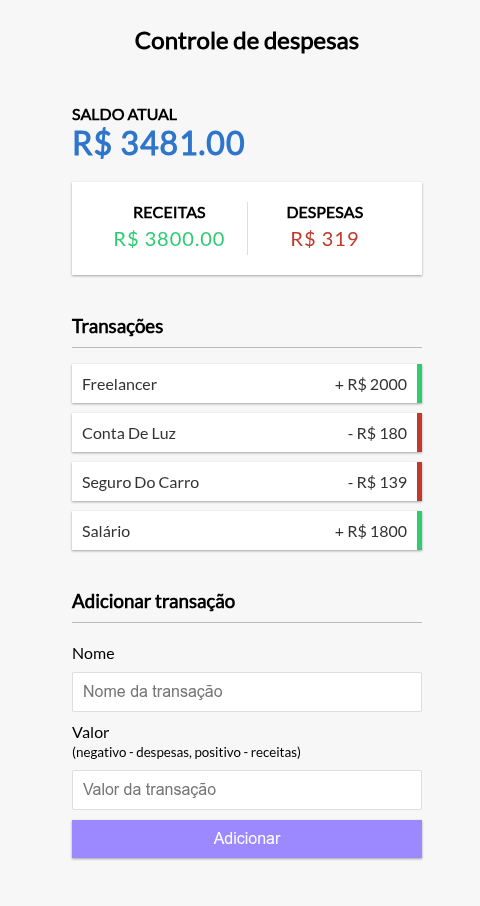

# Controle de Despesas

Uma aplicação web de controle de despesas desenvolvido com **HTML**, **CSS** e **Javascript**. **Permite adicionar receitas e despesas, visualizar o saldo atualizado em tempo real e remover transações**. Todos os dados são armazenados no **LocalStorage** do navegador, garantindo que suas informações permaneçam salvas mesmo após fechar a página.

## Funcionalidades

- Adicione transações de receitas ou despesas.
- Visualize o saldo atual, total de receitas e total de despesas.
- Remova transações individualmente.
- Armazenamento automático das transações no LocalStorage.
- Interface limpa, responsiva e fácil de usar.

## Demonstração

  

