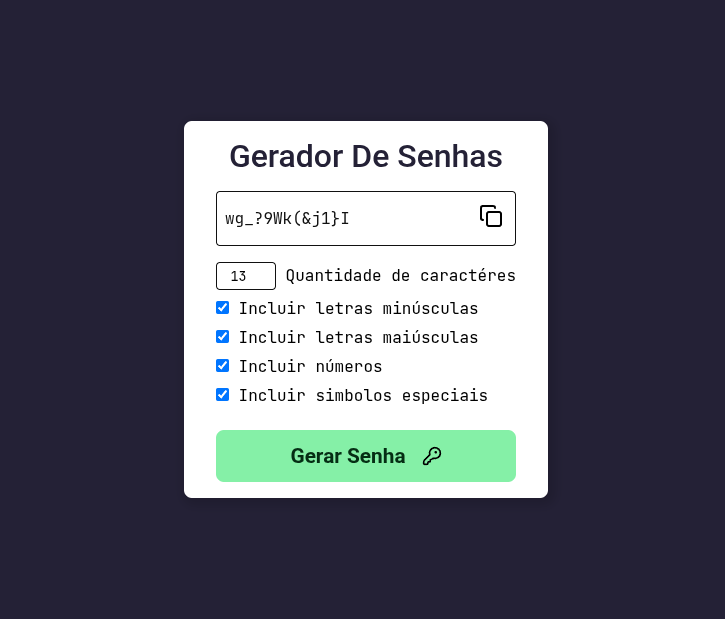

# Gerador De Senha

Um **Gerador de Senhas** altamente customizado podendo ter várias variações na senha, criando senhas fortes, permitindo assim que o usuário utilize essa senha em qualquer cadastro.

## Funcionalidades

- **Tamanho da Senha:**
  - O usuário pode definir o tamanho ou quantidade de caracteres que a sua senha possui.
- **Adição de Variações:**
  - O usuário pode escolher se deseja incluir letras **maiúsculas**, **minúsculas**, **símbolos especiais** ou **números**.

## Aprendizados

- **Clipboard:**
  - Utilização da API nativa do Javascript `navigator.clipboard.writeText()` para manipulação de `clipboard` ou `área de transferência` permitindo copiar o conteúdo da senha.
- **Validações:**
  - Validações de `input` e `checkbox` garantindo que o dado certo seja enviado.
- **Math:**
  - Utilização do `Math.floor()` para conversão de valores vindos do input pois esses valores sempre serão strings.
  - Utilização do `Math.random()` para gerar números aleatórios e assim popular a string que será a senha final.

## Demonstração

  

