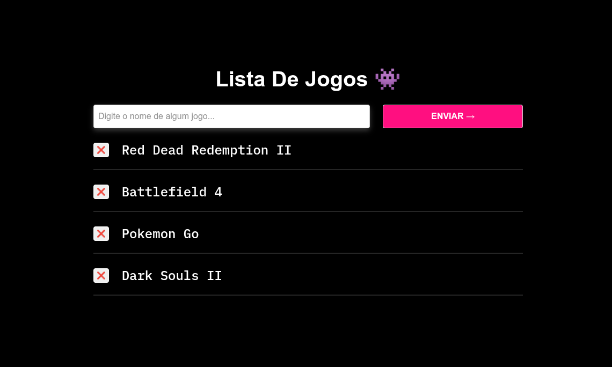

# Lista de Jogos

Uma aplicação web interativa desenvolvida com **HTML**, **CSS** e **JavaScript** puro, sem dependências de frameworks ou bibliotecas externas. Esta aplicação permite que os usuários **adicionem**, **visualizem** e **removam** seus jogos favoritos de forma dinâmica, oferecendo uma experiência fluida e intuitiva.

## Funcionalidades

- **Desenvolvimento com tecnologias nativas:** Construída inteiramente com **HTML5**, **CSS3** e **JavaScript (ES6+)**, garantindo alta performance, leveza e controle total sobre o código.

- **Manipulação de arrays:** Os jogos são armazenados em um **array** JavaScript, permitindo gerenciamento eficiente e manipulação dinâmica dos dados.

- **Criação dinâmica de elementos:** Utiliza `document.createElement()` para gerar elementos `<li>` no **DOM** de forma dinâmica, refletindo as ações do usuário em tempo real.

- **Gerenciamento de eventos:** Implementa **event listeners** para eventos como `click` e `submit`, proporcionando interações intuitivas para adicionar e remover jogos.

- **Interface responsiva e amigável:** Estilizada com **CSS** puro, oferecendo uma apresentação visual clara, moderna e adaptável a diferentes dispositivos.

## Técnologias Utilizadas

- `index.html`: Estruturação semântica da interface da aplicação.

- `style.css`: Estilização responsiva e visualmente atraente.

- `script.js`: Lógica para manipulação de dados, eventos e DOM.

## Demonstração

  

## Licença

Este projeto está licenciado sob a licença MIT. Veja o arquivo [`LICENSE`](LICENSE) para mais detalhes.
