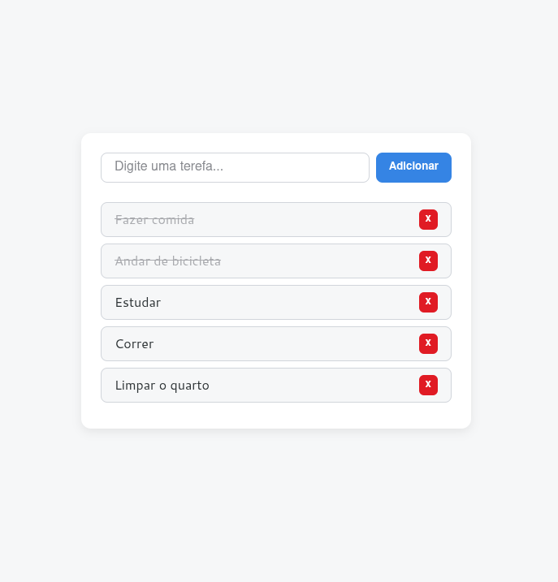

# Lista de Tarefas

Uma aplicação interativa de **lista de tarefas**, desenvolvida com **HTML**, **CSS** e **JavaScript**, onde o usuário pode **adicionar**, **marcar como concluída** ou **excluir** tarefas. O foco deste projeto foi reforçar os fundamentos da manipulação do **DOM**, **arrays** e **eventos** em JavaScript, aplicando boas práticas e organização de código.

## Funcionalidades

- **Adicionar tarefas:** Ao digitar um texto e enviar o formulário, uma nova tarefa é adicionada à lista.
- **Marcar como concluída:** Ao clicar em uma tarefa, ela muda de estado visual para (riscada e com cor opaca).
- **Excluir tarefas:** Cada item da lista possui um botão “x” que remove a tarefa do array e re-renderiza a lista dinamicamente.
- **Validação de entrada:** O formulário impede o envio de tarefas vazias e exibe uma mensagem de erro.
- **Mensagem de lista vazia:** Caso não existam tarefas, é exibida uma mensagem informando que a lista está vazia.

## Aprendizados

Durante o desenvolvimento deste projeto, aprimorei os seguintes conceitos:

- **Manipulação de Arrays:**
  - Utilização do método `splice()` para remover itens específicos do array de tarefas.
  - Uso do `push()` para adicionar novos elementos.
- **Renderização dinâmica:**
  - Recriação da lista no DOM a cada alteração (adição, exclusão ou marcação), garantindo que a interface fique sempre sincronizada com o array `tasks`.
- **Controle de estado visual com classes CSS:**
  - Alternância do estado “completado” utilizando `element.classList.toggle('completed')`.
- **Validação e feedback visual:**
  - Implementação de mensagens de erro e estado vazio para melhorar a experiência do usuário.
- **Separação de responsabilidades:**
  - Uso de funções pequenas e específicas (`resetInput`, `clearDom`, `showEmptyListMessage`, `render`, etc.) para manter o código limpo e organizado.
- **Boas práticas no uso de eventos:**
  - Utilização do evento `submit` no `form` permitindo assim que os dados sejam submetidos tanto apertando a tecla `enter` ou clicando no botão de **adicionar**.

## Demonstração

  

