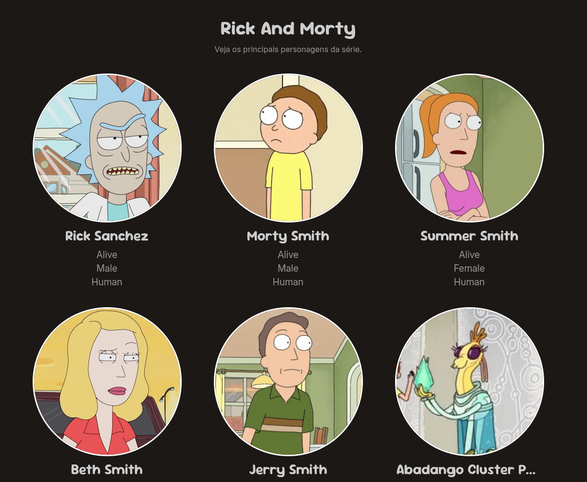

# Rick and Morty

Uma aplicação que consome a [API do Rick and Morty](https://rickandmortyapi.com/documentation) onde é exibido uma lista com todos os personagens da serie com **imagens**, **nomes**, **status**, a aplicação foi criada com **HTML**, **CSS** e **JavaScript**. Todas as requisições são feitas com a **API Fetch** e renderizadas via javascript.

## Tecnologias Utilizadas

- [`index.html`](index.html): Estrutura da interface.
- [`style.css`](./src/style.css): Estilos visuais.
- [`script.js`](./src/script.js): Lógica de funcionamento e manipulação do LocalStorage.

## Funcionalidades

- Botao para carregar mais personagens.
- Exibição de personagens com imagem, nome e status.
- Uso da API Fetch para obter dados da API do Rick and Morty.

## Demonstração

  

## Licença

Este projeto está licenciado sob a licença MIT. Veja o arquivo [`LICENSE`](LICENSE) para mais detalhes.
