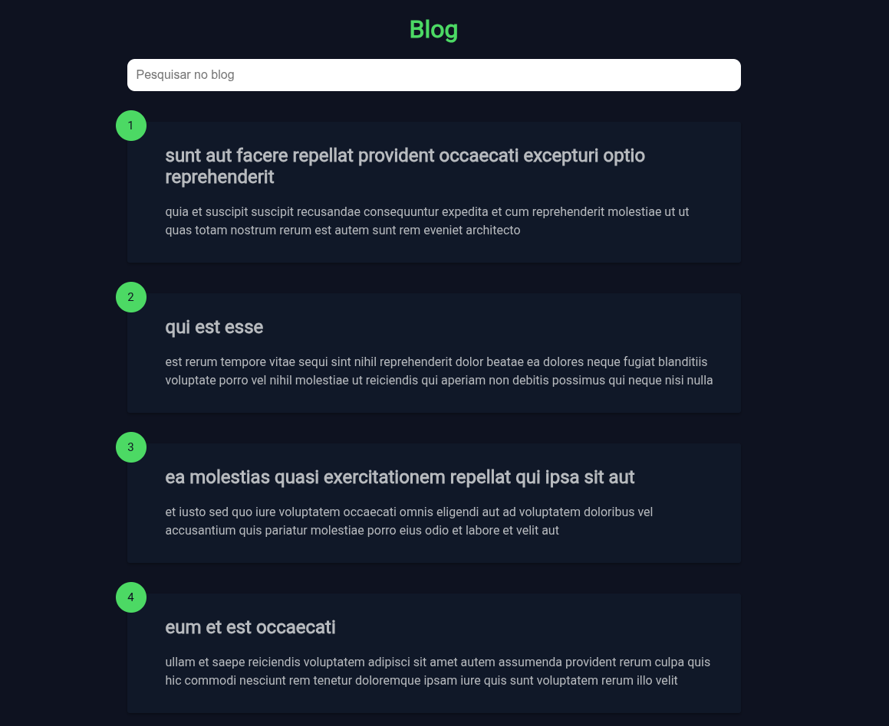

# Scroll Infinito

Uma aplicação web dinâmica que implementa um blog com **scroll infinito** e funcionalidade de pesquisa de artigos, desenvolvida utilizando **HTML**, **CSS** e **JavaScript** puro, sem dependências de frameworks ou bibliotecas externas. O projeto consome a API pública do _JSONPlaceholder_ para simular a obtenção de posts, proporcionando uma experiência fluida e interativa.

## Funcionalidades

- **Scroll infinito:** Carrega automaticamente mais posts à medida que o usuário rola a página para baixo, utilizando **event listeners** para detectar o fim da rolagem e requisições assíncronas para buscar novos dados.

- **Pesquisa dinâmica:** Permite filtrar artigos por **título** ou **descrição** com uma busca em tempo real, implementada com manipulação de arrays e eventos de input.

- **Criação dinâmica de elementos:** Gera elementos HTML no **DOM** utilizando `document.createElement()` para exibir os posts dinamicamente, garantindo uma renderização eficiente.

- **Interface responsiva:** Estilizada com **CSS** puro para oferecer uma experiência visual consistente e adaptável a diferentes dispositivos.

- **Feedback visual:** Inclui um spinner de carregamento para indicar o progresso de requisições à API, melhorando a experiência do usuário.

- **Integração com API:** Utiliza a API pública do _JSONPlaceholder_ para simular dados de posts de forma realista.

## Tecnologias Utilizadas

- **HTML5:** Estruturação semântica da interface, definida no arquivo `index.html`.

- **CSS3:** Estilização responsiva e moderna, implementada em `style.css`.

- **JavaScript (ES6+):** Lógica de scroll infinito, pesquisa e manipulação do DOM, localizada em `script.js`.

- **API JSONPlaceholder:** Fonte de dados simulada para os posts, acessada via requisições **fetch**.

## Demonstração

  

